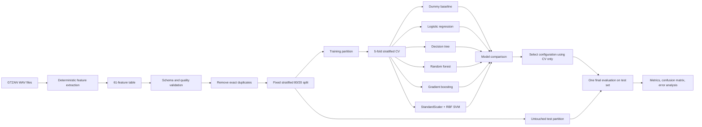

# Assignment 3 - Project Architecture and Experimental Plan

**Project topic:** Music Genre Recognition Using Machine Learning

---

## A. Operationalization of the Research Question

### Formal Experimental Framework and Research Objective

The project investigates automatic music genre recognition from engineered audio descriptors. The task is formulated as supervised multi-class classification: each recording is represented by a fixed-length numerical feature vector and assigned to one of ten genres: `blues`, `classical`, `country`, `disco`, `hiphop`, `jazz`, `metal`, `pop`, `reggae`, or `rock`.

The research question established in the earlier work is:

> Can music genre be recognized automatically from extracted audio features using classical machine learning methods, and does a non-linear RBF support vector machine improve over simpler baseline models under a controlled evaluation protocol?

The operational hypothesis is:

> A classifier trained on engineered audio descriptors will achieve at least 70% held-out test accuracy, and the RBF SVM will provide a measurable improvement over the strongest baseline evaluated under identical experimental conditions.

The 70% threshold is substantially higher than the approximately 10% chance level of a balanced ten-class problem, while remaining realistic for a compact feature-based system. The hypothesis concerns the selected dataset and protocol only. It does not claim universal genre recognition or superiority over systems trained on larger external datasets.

### Mapping the Research Question to the Experiment

| Conceptual element | Experimental operationalization |
|---|---|
| Research question | Ten-class prediction from 61 numerical audio features |
| Independent variable | Classifier family and its controlled hyperparameter configuration |
| Dependent variables | Accuracy, macro precision, macro recall, and macro F1 |
| Controlled variables | Cleaned observations, feature definitions, target labels, split, random seed, cross-validation folds, and test set |
| Primary hypothesis criterion | Held-out test accuracy of at least 0.70 |
| Comparative hypothesis criterion | RBF SVM exceeds the strongest baseline in test accuracy and macro F1 |
| Supporting evidence | Cross-validation mean and standard deviation, confusion matrix, per-class report, and train-validation gap |

Empirical evidence will consist of:

- performance above the dummy classifier and the predefined 70% accuracy threshold;
- consistent results between five-fold cross-validation and the untouched test set;
- improvement over the strongest baseline in both accuracy and macro F1;
- class-level results and a confusion matrix showing how performance is distributed across genres;
- cross-validation variability and the train-validation gap as indicators of stability and overfitting.

Assignment 2 showed that existing studies often combine different datasets, representations, classifiers, and protocols. This project instead holds the representation and evaluation conditions constant and changes the classifier family. Its contribution is a reproducible assessment of model behavior, not a new state-of-the-art architecture.

## B. Dataset Description and Justification

### Source and Accessibility

The experiment uses a local copy of the GTZAN ten-genre audio collection introduced by Tzanetakis and Cook [1]. The audio directory is configured through `AUDIO_DATASET_PATH` in `config.py`, and the feature extraction script processes the genre folders from that location. Raw audio is stored outside the repository, while the extracted numerical table is stored as `data/features_extended.csv`.

This permits regeneration of the feature table without redistributing the audio. The exact download source and version must be recorded. The repository does not contain a license permitting redistribution of the local audio copy, so only the extraction code and derived feature table are included.

### Size, Structure, and Data Types

The source collection contains 1,000 approximately 30-second audio excerpts, initially distributed equally across ten classes with 100 recordings per genre. Feature extraction produces one tabular observation per recording.

The generated table contains:

| Property | Value |
|---|---:|
| Initial observations | 1,000 |
| Exact duplicate rows detected | 13 |
| Observations after cleaning | 987 |
| Predictor variables | 61 numerical features |
| Target variables | 1 categorical label (`genre`) |
| Number of classes | 10 |
| Missing values in current extraction | 0 |

After removal of exact duplicates, the planned class counts are:

| Genre | Observations |
|---|---:|
| blues | 100 |
| classical | 100 |
| country | 100 |
| disco | 99 |
| hiphop | 98 |
| jazz | 100 |
| metal | 93 |
| pop | 98 |
| reggae | 99 |
| rock | 100 |

The predictors summarize complementary acoustic properties:

| Feature group | Variables | Purpose |
|---|---:|---|
| Tempo | 1 | Approximate rhythmic speed |
| Zero-crossing rate | mean and standard deviation | Signal noisiness and high-frequency behavior |
| RMS energy | mean and standard deviation | Average energy and energy variation |
| Spectral centroid | mean and standard deviation | Perceived spectral brightness |
| Spectral bandwidth | mean and standard deviation | Spectral spread |
| Spectral rolloff | mean and standard deviation | Upper-frequency energy distribution |
| MFCC | 13 means and 13 standard deviations | Timbral representation |
| Chroma | 12 means and 12 standard deviations | Pitch-class and harmonic distribution |

The `librosa` extraction converts each waveform into a fixed-length vector using means and standard deviations of frame-level descriptors.

### Dataset Suitability

GTZAN provides a balanced, computationally manageable ten-class task suitable for repeated validation on desktop hardware. It directly supports the question of whether compact global descriptors and an RBF SVM are effective without introducing a data-intensive neural architecture.

### Known Biases, Licensing, and Limitations

The dataset has important limitations that constrain interpretation:

- GTZAN is small relative to the diversity within each musical genre.
- Published analyses identify repetitions, possible mislabeling, distortions, and artist repetition [2].
- Reliable artist metadata are not available in the local feature table, so an artist-independent split cannot be guaranteed.
- Genre is treated as one fixed label even though genre categories overlap and annotation can be subjective.
- The global feature vector removes temporal order, local instrumentation changes, and structural development.
- Random track-level evaluation estimates performance on this collection, not cross-dataset or real-world generalization.

Exact duplicate removal reduces one source of optimism but does not remove near-duplicates, repeated artists, recording artifacts, or label ambiguity. FMA was considered because it is larger and provides predefined splits [3], but it would materially expand the scope and would not match the completed extraction pipeline.

## C. Experimental Pipeline Architecture

### Pipeline Architecture Diagram



### Modular Structure

The planned implementation is divided into independent modules:

| Module | Responsibility |
|---|---|
| `config.py` | Local path to the raw audio collection |
| `src/extract_features.py` | Audio loading and deterministic feature extraction |
| `data/features_extended.csv` | Canonical unscaled experimental feature table |
| `src/baseline_models.py` | Baseline pipelines, tuning, evaluation, and result export |
| `src/target_model.py` | RBF SVM optimization and comparison with the strongest baseline |
| `src/results_analysis.py` | Consolidated metrics, error analysis, stability, and interpretability |
| `docs/*.csv` | Machine-readable experimental outputs |

The canonical modeling input is the unscaled `features_extended.csv`. The globally scaled file is exploratory only because its scaler was fitted before the experimental split.

### Fixed and Variable Components

The following components remain fixed across experiments:

- the cleaned 987-observation dataset;
- all 61 feature definitions;
- the target labels;
- the 80/20 stratified train-test split;
- `random_state=30`;
- five stratified cross-validation folds;
- the held-out test partition;
- the primary and secondary evaluation metrics;
- the rule that learned transformations are fitted on training data only.

The following components vary:

- classifier family;
- model-specific preprocessing;
- bounded hyperparameter values.

Logistic regression and SVM require scaling. Tree models do not, but the implementation retains a uniform `Pipeline` wrapper; standardization does not change ordering-based tree splits. Every learned transformation remains inside its pipeline.

### Data Leakage Prevention

Data leakage will be prevented through the following controls:

1. Exact duplicates are removed before the train-test split.
2. The held-out test set is created once and is not used for model selection.
3. `StandardScaler` is fitted inside each training fold through `Pipeline`.
4. Hyperparameters are selected using only cross-validation on the training partition.
5. The final test set is evaluated only after the model configuration has been selected.
6. The unscaled canonical table is used instead of the exploratory globally scaled file.

### Reproducibility Considerations

The experiment will be considered reproducible when another researcher with the same GTZAN dataset version can:

1. configure the raw audio path;
2. regenerate the 61-feature table with the extraction script;
3. obtain the same duplicate-removal policy and class schema;
4. recreate the split using seed `30`;
5. run the baseline and target-model scripts;
6. reproduce the machine-readable metric, report, and confusion-matrix files.

The repository will preserve code, configuration values, result tables, feature definitions, and dependency information. Raw audio remains external because of size and licensing considerations.

## D. Baseline and Comparative Models

The model set is designed as an empirical performance ladder. Each model answers a different methodological question.

| Model | Rationale | Expected strength | Expected weakness | Key hyperparameters |
|---|---|---|---|---|
| Dummy classifier | Establishes the lower bound | Transparent chance-level reference | Does not learn audio patterns | `strategy="most_frequent"` |
| Logistic regression | Tests approximate linear separability | Fast, stable, interpretable linear boundary | Cannot model complex non-linear interactions | `C: [0.1, 1, 10]`, `solver="lbfgs"` |
| Decision tree | Simple classical non-linear model | Captures thresholds and interactions | High variance and overfitting risk | `max_depth: [5, 10, None]`, `min_samples_leaf: [1, 3, 5]` |
| Random forest | Strong classical tabular baseline | Robust non-linear interactions and low preprocessing sensitivity | Can overfit small data and is less interpretable | `n_estimators: [200, 500]`, `max_depth: [None, 15]`, `max_features: ["sqrt", "log2"]` |
| Gradient boosting | Comparative ensemble model | Sequentially corrects residual errors | Sensitive to tuning and small-sample noise | `n_estimators: [100, 200]`, `learning_rate: [0.05, 0.1]`, `max_depth: [2, 3]` |
| RBF SVM | Proposed primary model | Suitable for small, medium-dimensional data and non-linear class boundaries | Scale-sensitive; may overfit with large `C` or unsuitable `gamma` | `C: [1, 3, 10, 30, 100]`, `gamma: ["scale", 0.03, 0.01, 0.003, 0.001]` |
The literature supports engineered audio descriptors and SVM for feature-based genre classification [1], [4]. RBF SVM is feasible for approximately one thousand examples and isolates classifier effects without external pre-training.

Comparability will be enforced through identical cleaned data, identical train-test partitions, identical validation folds, the same target labels, and the same metrics. Hyperparameter search spaces are deliberately bounded. The project does not require exhaustive optimization, and excessively broad searches would increase the risk of adapting the experiment to validation noise.

## E. Evaluation Protocol

### Train, Validation, and Test Strategy

The cleaned data will be divided using a stratified 80/20 train-test split:

```text
approximately 789 training/development observations
approximately 198 held-out test observations
```

The fixed seed `30` makes the stratified partition reproducible. Model selection uses five shuffled stratified folds on the training partition, with every candidate evaluated on the same folds. Grid search selects the highest mean validation accuracy.

### Primary and Secondary Metrics

The primary metric is **accuracy** because the classes are approximately balanced and the hypothesis defines a 70% threshold. Accuracy provides a direct answer to the proportion of correctly classified recordings.

The secondary metrics are:

- **macro precision**, showing whether predictions for every genre are reliable;
- **macro recall**, showing whether examples from every genre are recovered;
- **macro F1**, balancing precision and recall while assigning equal weight to each class;
- **confusion matrix**, identifying systematic genre confusions;
- **per-class precision, recall, and F1**, preventing aggregate metrics from hiding weak classes;
- **cross-validation standard deviation**, estimating sensitivity to the sampled folds;
- **train-validation gap**, indicating possible overfitting.

### Statistical Comparison and Decision Rules

The research hypothesis will be considered supported when:

1. the selected model achieves held-out test accuracy of at least 0.70;
2. the result is substantially above the dummy baseline;
3. the RBF SVM exceeds the strongest baseline in both test accuracy and macro F1;
4. cross-validation and test results are reasonably consistent;
5. improvement is not presented without reporting variance and the train-validation gap.

Because all models predict the same held-out observations, the comparison reports their paired differences in accuracy and macro F1. Cross-validation mean and standard deviation are used to assess stability. No formal statistical significance claim will be made from one small test partition.

### Evaluation Bias Control

The protocol prevents inflated reporting in several ways:

- no model is selected by its test-set ranking;
- the metric set is defined before final evaluation;
- all candidates use the same development and test observations;
- preprocessing and selection are nested inside pipelines;
- results include class-level errors and overfitting indicators, not only the best accuracy.

## F. Risk Assessment and Feasibility Plan

### Computational Requirements and Estimated Time

The reference environment is Windows, a six-core Intel Core i5-9400F, approximately 16 GB RAM, Python, `librosa`, `pandas`, and `scikit-learn`. No GPU is required. Feature extraction is the main I/O cost; training is lightweight for fewer than one thousand rows and 61 predictors.

Expected execution scale:

| Stage | Estimated requirement |
|---|---|
| Feature extraction | Several minutes to tens of minutes, depending on disk and audio decoding |
| Baseline training and bounded tuning | Several minutes |
| RBF SVM grid search | Seconds to several minutes |
| Final evaluation and CSV generation | Less than several minutes |
| Storage | Raw audio plus less than a few megabytes for feature and result tables |

### Technical Risks and Fallback Strategies

| Risk | Impact | Mitigation or fallback |
|---|---|---|
| Corrupted or unreadable audio | Missing observations | Log the filename, exclude it, and document the exclusion |
| Exact or near-duplicate recordings | Optimistic evaluation | Remove exact duplicates; document remaining uncertainty |
| Artist overlap without metadata | Confounded generalization estimate | Restrict claims to the current split and propose artist-filtered future validation |
| Small sample size | High variance and overfitting | Use bounded grids, five-fold stratified CV, and simple models |
| Global features lose temporal structure | Weak performance on overlapping genres | Treat this as a representation limitation; future fallback is richer temporal features |
| Hyperparameter search becomes too expensive | Delayed experimentation | Reduce the grid while preserving representative low, medium, and high values |
| Primary model does not reach 70% | Hypothesis not supported | Report the negative result and retain the strongest validated baseline |
| Licensing uncertainty for raw audio | Reproducibility and redistribution constraint | Publish code, feature schema, and derived results; require users to obtain an authorized dataset copy |

Fallbacks will not change metrics or search the test set after results are observed. If SVM fails, the hypothesis will be rejected or qualified.

### Feasibility Timeline

| Week | Planned work | Deliverable |
|---|---|---|
| 1 | Verify raw files, extraction schema, labels, missing values, and duplicates | Validated canonical feature table |
| 2 | Finalize leakage-safe preprocessing and fixed split | Reproducible preprocessing pipeline |
| 3 | Implement dummy, linear, tree, and ensemble baselines | Baseline metric and error tables |
| 4 | Implement RBF SVM and bounded hyperparameter search | Selected primary-model configuration |
| 5 | Run final held-out evaluation and comparative analysis | Metrics, classification report, and confusion matrix |
| 6 | Analyze errors, robustness, limitations, and reproducibility | Final experimental report and documented artifacts |

The timeline leaves enough separation between model selection and final evaluation to preserve the test set. Any deviation from the fixed architecture, feature schema, model set, or evaluation rules will be recorded with its reason and expected methodological effect.

---

## References

[1] G. Tzanetakis and P. Cook, "Musical Genre Classification of Audio Signals," *IEEE Transactions on Speech and Audio Processing*, vol. 10, no. 5, pp. 293-302, 2002, doi: [10.1109/TSA.2002.800560](https://doi.org/10.1109/TSA.2002.800560).

[2] B. L. Sturm, "The GTZAN Dataset: Its Contents, Its Faults, Their Effects on Evaluation, and Its Future Use," arXiv:1306.1461, 2013. [Online]. Available: [arXiv](https://arxiv.org/abs/1306.1461).

[3] M. Defferrard, K. Benzi, P. Vandergheynst, and X. Bresson, "FMA: A Dataset for Music Analysis," in *Proceedings of ISMIR*, 2017, pp. 316-323. [Online]. Available: [ISMIR PDF](https://archives.ismir.net/ismir2017/paper/000075.pdf).

[4] I. Panagakis, E. Benetos, and C. Kotropoulos, "Music Genre Classification: A Multilinear Approach," in *Proceedings of ISMIR*, 2008, pp. 583-588. [Online]. Available: [ISMIR PDF](https://archives.ismir.net/ismir2008/paper/000181.pdf).
